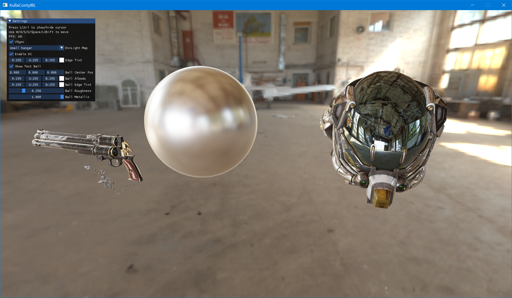
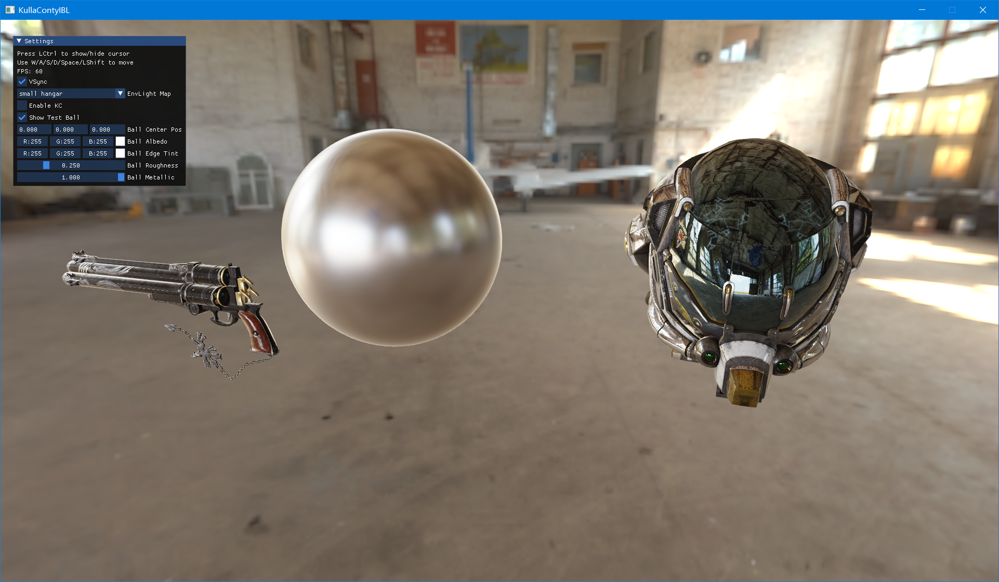
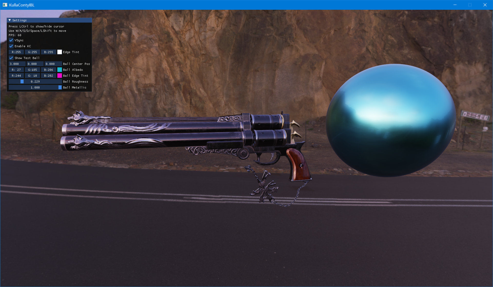
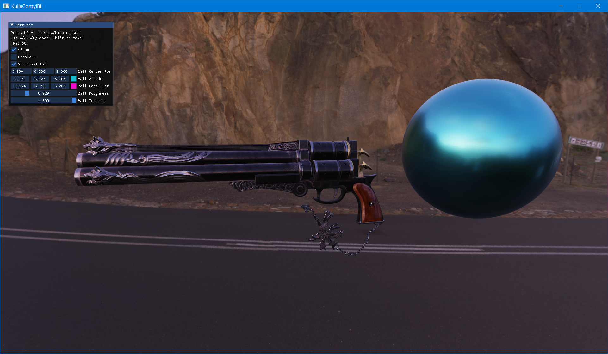
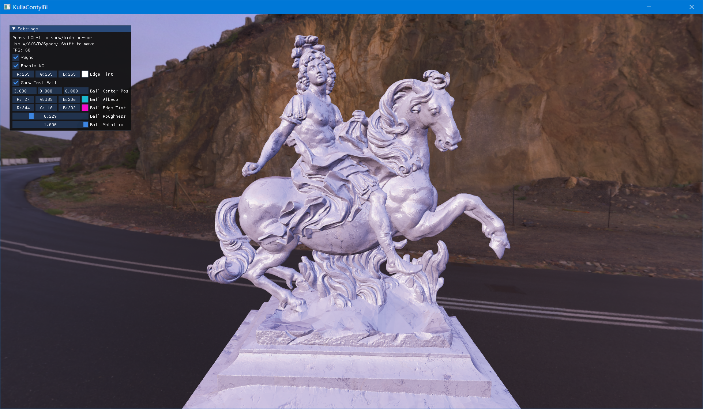
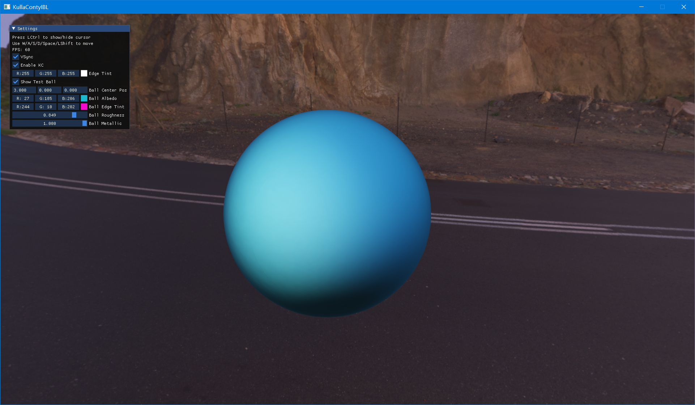
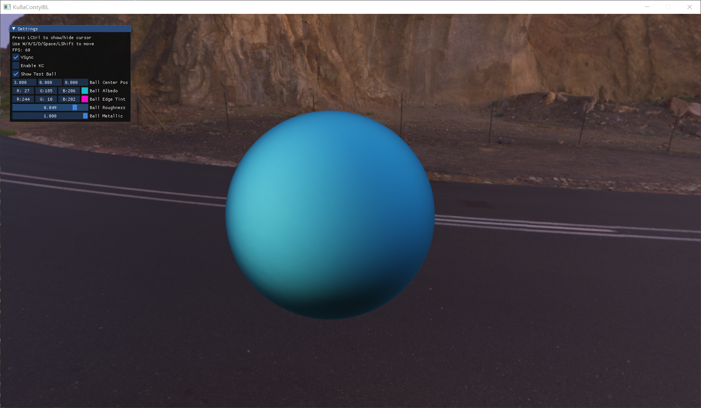

# IBL & KullaContyBRDF
Image Based Lighting with Kulla-Conty BRDF Combined

## Implement Detail
 Some knowns
$$f_{kc} = f_{ms}(\mu_o,\mu_i) = \frac{(1-E(\mu_o))(1-E(\mu_i))}{\pi (1-E_{avg})}$$

$$E(\mu_o) = \int^{2\pi}_{0}\int^1_0f(\mu_o,\mu_i,\phi)\mu_id\mu_id\phi$$

$$E_{avg} = 2\int^1_0E(\mu)\mu d\mu$$

For micro-surface normal distribute function
$$pdf(\omega_h) = D(\omega_h)(\omega_h\cdot\omega_n)$$

$$pdf(\omega_i) = \frac{D(\omega_h)(\omega_h\cdot\omega_n)}{4(\omega_h\cdot\omega_i)}$$
Sampling the $f_{kc}\cdot\cos\theta$ with $pdf(\omega_i)$
$$\frac{1}{N}\sum^N_i\frac{4f_{ms}(\omega_i,\omega_o)\cdot(\omega_i,\omega_n)\cdot(\omega_i,\omega_h)}{D(\omega_h)\cdot(\omega_h,\omega_n)}$$
Combined with BRDF Pre-Integral in code
```glsl
vec3 integrateBRDF(float NdotV,float roughness){

    float scale = 0;
    float bias = 0;
    float fms = 0;

    vec3 wo = vec3(sqrt(1.0 - NdotV * NdotV), 0.0, NdotV);
    vec3 wn = vec3(0,0,1);
    float e_miu_o = texture(Emiu,vec2(NdotV,roughness)).r;
    for(int i = 0; i < sample_count; ++i){
        vec2 xi = hammersley(i, sample_count);
        vec3 wh = importanceSampleGGX(xi,wn,roughness);
        vec3 wi = normalize(2 * dot(wo,wh) * wh - wo);

        float NDF = distributionGGX(wn,wh,roughness);

        float NdotL = max(0, wi.z);
        float NdotH = max(0, wh.z);
        float LdotH = max(0, dot(wi,wh));
        float VdotH = max(0, dot(wo,wh));
        if(NdotL > 0){
            float G = geometrySmith(wn,wo,wi,roughness);
            float G_Vis = (G * VdotH) / (NdotH * NdotV);
            float fc = pow(1.0 - VdotH, 5);

            scale += (1.0 - fc) * G_Vis;
            bias += fc * G_Vis;

            float e_miu_i = texture(Emiu,vec2(NdotL,roughness)).r;
            float e_avg = texture(Eavg,roughness).r;
            float f = (1.0 - e_miu_o) * (1.0 - e_miu_i) / (PI * (1.0 - e_avg));
            float f_add = 4 * f * NdotL * LdotH / (NdotH * NDF);
            if(f_add != 1.0 / 0.0)
                fms += f_add;
        }
    }
    scale /= sample_count;
    bias  /= sample_count;
    fms /= sample_count;
    return vec3(scale,bias,fms);
}
```
Consider with albedo in render pass
```glsl
    vec3 f_macro = F * brdf.x + brdf.y;
    if(bool(enable_kc)){
        vec3 F_avg = averageFresnel(albedo,edge_tint);
        vec3 E_avg = texture(EAvg,roughness).xxx;
        vec3 f_add = F_avg * E_avg / (1.0 - F_avg *(1.0 - E_avg));
        vec3 f_multi = brdf.z * f_add;
        f_macro += f_multi;
    }
```

## Screenshot
enable

disable

enable

disable

enable

disable

enable

disable

